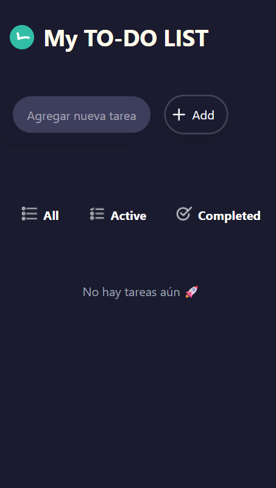
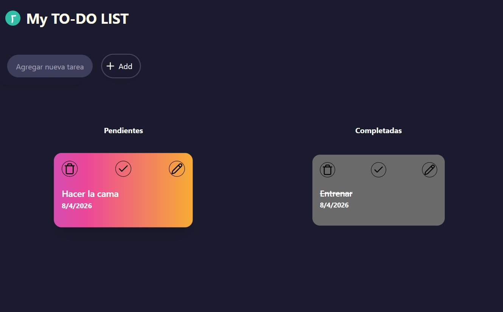

# 📝 ToDo List App - React & Tailwind

Aplicación de gestión de tareas desarrollada con React y Tailwind CSS.  
Permite crear, editar, completar y eliminar tareas con una interfaz moderna y responsive.


## 🚀 Demo

👉 stellular-gaufre-dcde38.netlify.app


## 📸 Capturas

### 📱 Mobile


### 💻 Desktop



## ✨ Características

- ✅ Crear nuevas tareas
- ✏️ Editar tareas existentes
- ✔️ Marcar como completadas
- 🗑️ Eliminar tareas con animación
- 🔍 Filtros:
  - All
  - Active
  - Completed
- 📱 Diseño responsive:
  - Mobile → lista única con filtros
  - Tablet/Desktop → dos columnas (Pendientes / Completadas)
- 💾 Persistencia con localStorage
- 🎨 Animaciones y hover states


## 🛠️ Tecnologías

- React (useState, useEffect)
- Tailwind CSS
- JavaScript (ES6+)
- HTML5 & CSS3
- Lucide React (iconos)


## 📦 Instalación

1. Clonar repositorio:

```bash
git clone https://github.com/abel1994-mza/Proyecto-ToDo-List.git
